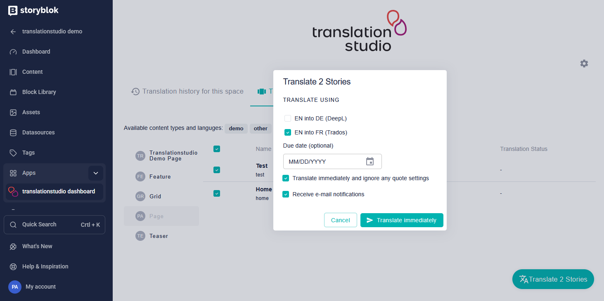

# Storyblok plugin for translationstudio - dashboard

This plugin allows you to add enterprise translation management to your Stroyblok translation process. 

> [!IMPORTANT]
> You will need a [translationstudio.tech](https://translationstudio.tech) subscription

## About this extension

This extension connects translationstudio to your Storyblok spaces. It connects to the translationstudio gateway `https://storyblok.translationstudio.tech` and, thereby, keeps all business logic separate. Consequently, this extension only adds necessary UI elements and features to Storyblok.

The dashboard extension consinsts of 2 features

1. Translation history across your space
2. Translation of multiple stories at the same time

### Translation History

The translation history shows the most recent translationstudio activities in your space. That way, you can stay on top of your translation process.


### Translation of multiple stories

With this dashboard, you can select multiple stories and translate them in one go. 




## Available Connectors

The list of available translation connectors is growing constantly. You can find the full list at https://translationstudio.tech

## Adding this extension to your Storyblok spaces

> [!IMPORTANT]
> You will need a Storyblok subscription that allows you to create extensions.

### Hosting

You will need to host an instance of this plugin in order to add it to Storyblok. This documentation assumes the URL to be `https://storyblok-dashboard.mycompany.com`.

Setup the file `.env` and add the environmental variables (they will be made available during the Storyblok extension creation, see below):

- `EXTENSION_URL`: The URL of this application, e.g. `https://storyblok-dashboard.mycompany.com`
- `NEXT_PUBLIC_EXTENSION_APP_ID`: The app id of your extension
- `EXTENSION_CLIENT_ID`: OAuth client id
- `EXTENSION_CLIENT_SECRET`: OAuth client secret
- `NEXT_PUBLIC_EXTENSION_SLUG`: The Storyblok extension's slug

Once configured, you can start the application using

```shell
npm install
npm start
```

or deploy it to the platform provider of your choice.

### Creating the extension in Storyblok's Partner Portal

1. Open [Storyblok's Partner Portal Extension View](https://app.storyblok.com/#/partner/apps)
2. Click On **New Extension**
3. Fill in the fields `name` and `slug`.
4. Select `Sidebar` as extension type
5. Click on **Save**

Once the extension has been created, a new entry will appear inside the extension list. Open it and navigate to the `OAuth 2.0 and Pages` tab.

Configure the following properties base on the previous steps:

- **Index to your page**: `https://storyblok-dashboard.mycompany.com`
- **Redirection endpoint**: `https://storyblok-dashboard.mycompany.com/api/connect/callback`

### Create a personal access token

To allow translationstudio to access your space(s), you will need to create respective access tokens. These will be needed when configuring your translationstudio Storyblok connector with your translationstudio account.

### Installing your Storyblok extension to your spaces

To install the application to your space(s), follow the steps below:

1. Navigate to your extension's settings page.
2. Open the **General Tab**.
3. Open the **Install Link** in a new browser tab.
4. Select the space this extension should be installed to.
5. Open the selected space.
6. Access the app by clicking on the app menu entry on the left.
7. Approve the necessary access for the tool.

The installation process is only done once per space. At first, you will be asked to provide a valid license which you will obtain once you created your translationstudio account.


## Development

You can develop using `ngrok http http://localhost:3000`